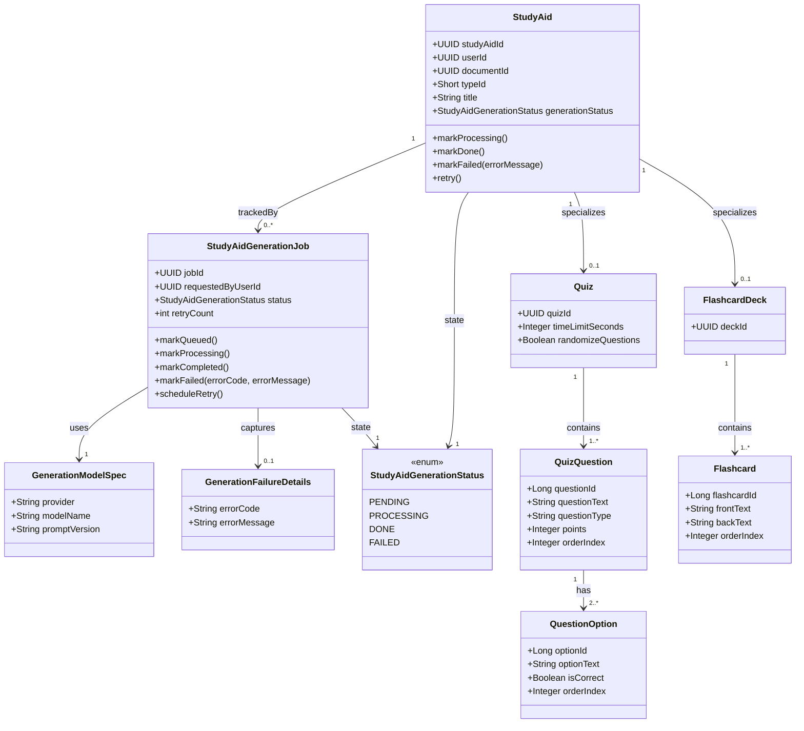
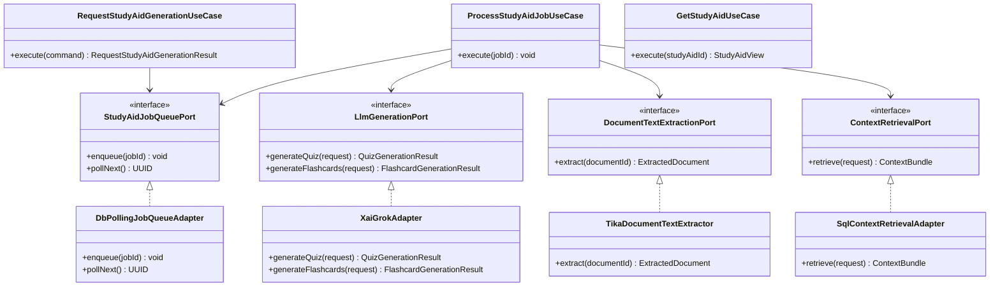
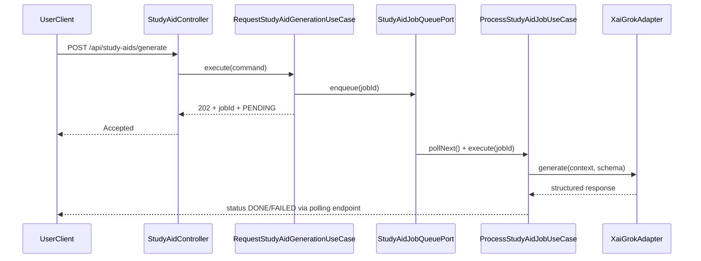

# Study Aids DDD Class Diagrams

## Domain Model Diagram

```mermaid
classDiagram
    class StudyAid {
      +UUID studyAidId
      +UUID userId
      +UUID documentId
      +Short typeId
      +String title
      +StudyAidGenerationStatus generationStatus
      +markProcessing()
      +markDone()
      +markFailed(errorMessage)
      +retry()
    }

    class StudyAidGenerationJob {
      +UUID jobId
      +UUID requestedByUserId
      +StudyAidGenerationStatus status
      +int retryCount
      +markQueued()
      +markProcessing()
      +markCompleted()
      +markFailed(errorCode, errorMessage)
      +scheduleRetry()
    }

    class GenerationModelSpec {
      +String provider
      +String modelName
      +String promptVersion
    }

    class GenerationFailureDetails {
      +String errorCode
      +String errorMessage
    }

    class Quiz {
      +UUID quizId
      +Integer timeLimitSeconds
      +Boolean randomizeQuestions
    }

    class QuizQuestion {
      +Long questionId
      +String questionText
      +String questionType
      +Integer points
      +Integer orderIndex
    }

    class QuestionOption {
      +Long optionId
      +String optionText
      +Boolean isCorrect
      +Integer orderIndex
    }

    class FlashcardDeck {
      +UUID deckId
    }

    class Flashcard {
      +Long flashcardId
      +String frontText
      +String backText
      +Integer orderIndex
    }

    class StudyAidGenerationStatus {
      <<enum>>
      PENDING
      PROCESSING
      DONE
      FAILED
    }

    StudyAid "1" --> "0..*" StudyAidGenerationJob : trackedBy
    StudyAidGenerationJob --> "1" GenerationModelSpec : uses
    StudyAidGenerationJob --> "0..1" GenerationFailureDetails : captures
    StudyAid --> "1" StudyAidGenerationStatus : state
    StudyAidGenerationJob --> "1" StudyAidGenerationStatus : state
    StudyAid "1" --> "0..1" Quiz : specializes
    StudyAid "1" --> "0..1" FlashcardDeck : specializes
    Quiz "1" --> "1..*" QuizQuestion : contains
    QuizQuestion "1" --> "2..*" QuestionOption : has
    FlashcardDeck "1" --> "1..*" Flashcard : contains
```

## Application And Infrastructure Ports

```mermaid
classDiagram
    class RequestStudyAidGenerationUseCase {
      +execute(command) RequestStudyAidGenerationResult
    }

    class ProcessStudyAidJobUseCase {
      +execute(jobId) void
    }

    class GetStudyAidUseCase {
      +execute(studyAidId) StudyAidView
    }

    class LlmGenerationPort {
      <<interface>>
      +generateQuiz(request) QuizGenerationResult
      +generateFlashcards(request) FlashcardGenerationResult
    }

    class DocumentTextExtractionPort {
      <<interface>>
      +extract(documentId) ExtractedDocument
    }

    class ContextRetrievalPort {
      <<interface>>
      +retrieve(request) ContextBundle
    }

    class StudyAidJobQueuePort {
      <<interface>>
      +enqueue(jobId) void
      +pollNext() UUID
    }

    class XaiGrokAdapter {
      +generateQuiz(request) QuizGenerationResult
      +generateFlashcards(request) FlashcardGenerationResult
    }

    class TikaDocumentTextExtractor {
      +extract(documentId) ExtractedDocument
    }

    class SqlContextRetrievalAdapter {
      +retrieve(request) ContextBundle
    }

    class DbPollingJobQueueAdapter {
      +enqueue(jobId) void
      +pollNext() UUID
    }

    RequestStudyAidGenerationUseCase --> StudyAidJobQueuePort
    ProcessStudyAidJobUseCase --> LlmGenerationPort
    ProcessStudyAidJobUseCase --> DocumentTextExtractionPort
    ProcessStudyAidJobUseCase --> ContextRetrievalPort
    ProcessStudyAidJobUseCase --> StudyAidJobQueuePort
    LlmGenerationPort <|.. XaiGrokAdapter
    DocumentTextExtractionPort <|.. TikaDocumentTextExtractor
    ContextRetrievalPort <|.. SqlContextRetrievalAdapter
    StudyAidJobQueuePort <|.. DbPollingJobQueueAdapter
```

## End-To-End Sequence

```mermaid
sequenceDiagram
    participant U as UserClient
    participant C as StudyAidController
    participant R as RequestStudyAidGenerationUseCase
    participant Q as StudyAidJobQueuePort
    participant P as ProcessStudyAidJobUseCase
    participant X as XaiGrokAdapter

    U->>C: POST /api/study-aids/generate
    C->>R: execute(command)
    R->>Q: enqueue(jobId)
    R-->>C: 202 + jobId + PENDING
    C-->>U: Accepted

    Q->>P: pollNext() + execute(jobId)
    P->>X: generate(context, schema)
    X-->>P: structured response
    P-->>U: status DONE/FAILED via polling endpoint
```
