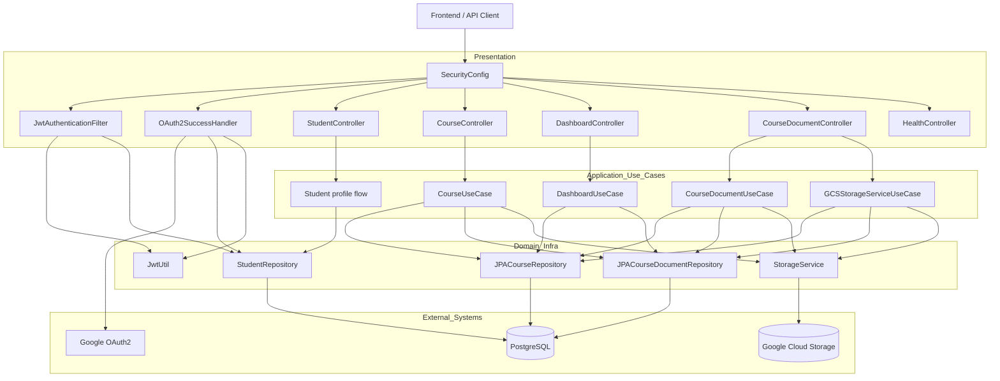

# Backend Architecture Diagram

## Notes
- Security is centralized in `SecurityConfig` with JWT resource-server support and OAuth2 login.
- Request authentication can come from bearer header, token cookie, or token query parameter resolver.
- Upload and document access flows use `StorageService` abstraction with GCS-backed implementation in production/docker profile.
