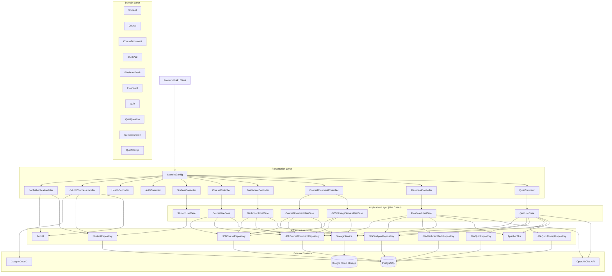

# Backend Architecture Diagram

## Notes

- Security is centralized in `SecurityConfig` with JWT resource-server support and OAuth2 login.
- Token resolution checks Authorization header, `token` cookie, and `token` query parameter.
- Upload and document-access flows are split between `GCSStorageServiceUseCase` (write) and `CourseDocumentUseCase` (read/delete).
- `FlashcardUseCase` and `QuizUseCase` orchestrate text extraction (Tika), AI generation (OpenAI), and persistence in a single synchronous transaction.
- `StorageService` is a port with two adapters: `GCSStorageService` (production) and `NoopStorageService` (test/dev).
