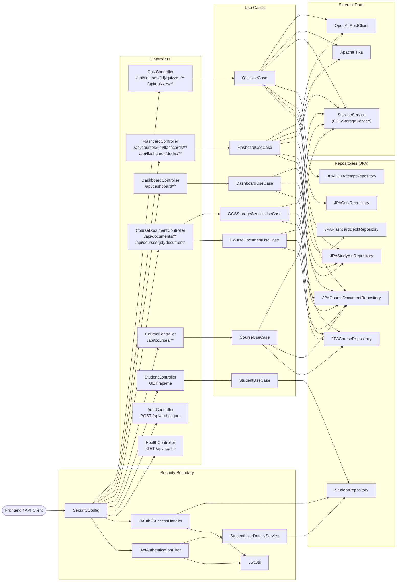

# C4 Level 3 — Component Diagram (Knowted Backend)

## Component Descriptions

| Component | Layer | Role |
|---|---|---|
| `SecurityConfig` | Infrastructure | Defines filter chain, CORS, OAuth2 login, JWT resource server, and bearer token resolver. |
| `JwtAuthenticationFilter` | Infrastructure | Extracts JWT from request, validates via `JwtUtil`, populates `SecurityContext`. |
| `OAuth2SuccessHandler` | Infrastructure | Post-Google-login: upserts Student, issues JWT, redirects frontend. |
| `JwtUtil` | Infrastructure | HMAC-SHA512 JWT generation, validation, and claim extraction. |
| `StudentUserDetailsService` | Infrastructure | Spring Security `UserDetailsService` that loads `Student` by UUID. |
| `*Controller` | Presentation | HTTP entry points: validates input, extracts principal, delegates to use cases. |
| `StudentUseCase` | Application | Look up student profile by ID. |
| `CourseUseCase` | Application | CRUD for courses; best-effort GCS cleanup on delete. |
| `CourseDocumentUseCase` | Application | Read/delete documents; cross-course document bank; presigned URL generation. |
| `GCSStorageServiceUseCase` | Application | Validate file type, upload to GCS, persist `CourseDocument`. |
| `DashboardUseCase` | Application | Aggregate summary counts and recent activity for dashboard. |
| `FlashcardUseCase` | Application | End-to-end flashcard generation: Tika → OpenAI → persist; CRUD for decks. |
| `QuizUseCase` | Application | End-to-end quiz generation; grading logic for MCQ/MCQ_MULTI attempts; attempt CRUD. |
| `JPA Repositories` | Infrastructure | Spring Data JPA adapters with custom JPQL queries for ownership and JOIN-fetch patterns. |
| `GCSStorageService` | Infrastructure | GCP SDK adapter for file upload, download, delete, V4 presigned URL. |
| `Apache Tika` | Infrastructure | Text extraction from PDF, DOCX, PPTX, TXT, and image files. |
| `OpenAI RestClient` | Infrastructure | Spring `RestClient` calling OpenAI Chat Completions to generate flashcard/quiz JSON. |
