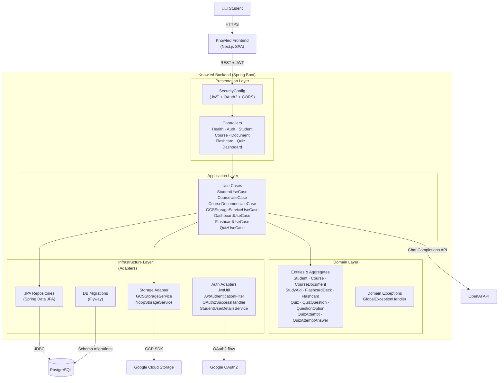

# C4 Level 2 — Container Diagram

## Container Responsibilities

| Container | Technology | Responsibility |
|---|---|---|
| **Presentation Layer** | Spring Web MVC, Spring Security | Route HTTP requests, enforce auth/CORS, map to/from DTOs. |
| **Application Layer** | Spring `@Service` | Orchestrate business workflows; coordinate domain, repos, and external ports. |
| **Domain Layer** | Plain Java (JPA annotations) | Encode business rules (e.g., 50-doc limit, quiz grading, answer snapshots). |
| **Infrastructure — Auth** | JJWT, Spring OAuth2 | JWT issuance/validation, Google OAuth2 callback handling. |
| **Infrastructure — Repos** | Spring Data JPA + Hibernate | Persistence adapters for all entities; custom JPQL queries for performance. |
| **Infrastructure — Storage** | Google Cloud Storage SDK | File upload, download, V4 presigned URL generation; `noop` adapter for dev/test. |
| **Infrastructure — Migrations** | Flyway | Version-controlled DDL applied at startup. |
