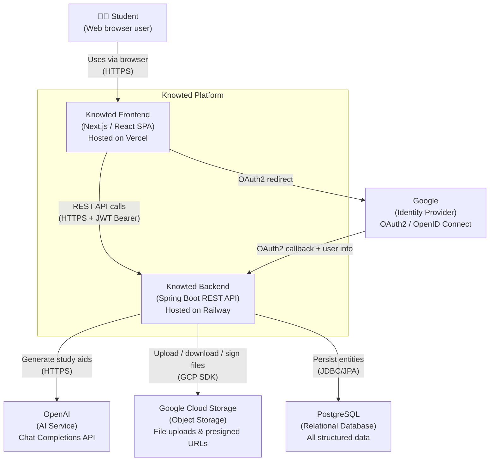

# C4 Level 1 — System Context Diagram

## Actors & Systems

| Name | Type | Description |
|---|---|---|
| Student | Person | End user who manages courses, uploads documents, and generates/takes study aids. |
| Knowted Frontend | Internal system | Single-page application providing the student UI. |
| Knowted Backend | Internal system | Spring Boot REST API — the subject of all other diagrams. |
| Google | External system | Authenticates students via OAuth2. |
| OpenAI | External system | Generates flashcard and quiz content from document text. |
| Google Cloud Storage | External system | Stores uploaded document files and issues time-limited presigned URLs. |
| PostgreSQL | External system | Persistent relational store for all structured data (courses, documents, study aids, attempts). |
