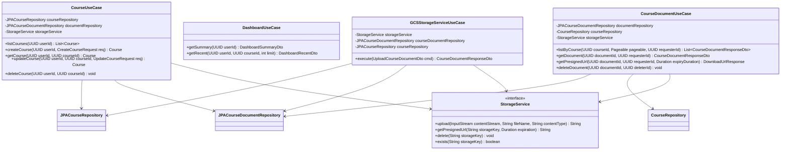

# Class Diagram - Application Layer

```mermaid
classDiagram
    class CourseUseCase {
      -JPACourseRepository courseRepository
      -JPACourseDocumentRepository documentRepository
      -StorageService storageService
      +listCourses(UUID userId) List~Course~
      +createCourse(UUID userId, CreateCourseRequest req) Course
      +getCourse(UUID userId, UUID courseId) Course
      +updateCourse(UUID userId, UUID courseId, UpdateCourseRequest req) Course
      +deleteCourse(UUID userId, UUID courseId) void
    }

    class DashboardUseCase {
      +getSummary(UUID userId) DashboardSummaryDto
      +getRecent(UUID userId, UUID courseId, int limit) DashboardRecentDto
    }

    class CourseDocumentUseCase {
      -JPACourseDocumentRepository documentRepository
      -CourseRepository courseRepository
      -StorageService storageService
      +listByCourse(UUID courseId, Pageable pageable, UUID requesterId) List~CourseDocumentResponseDto~
      +getDocument(UUID documentId, UUID requesterId) CourseDocumentResponseDto
      +getPresignedUrl(UUID documentId, UUID requesterId, Duration expiryDuration) DownloadUrlResponse
      +deleteDocument(UUID documentId, UUID deleterId) void
    }

    class GCSStorageServiceUseCase {
      -StorageService storageService
      -JPACourseDocumentRepository courseDocumentRepository
      -JPACourseRepository courseRepository
      +execute(UploadCourseDocumentDto cmd) CourseDocumentResponseDto
    }

    class StorageService {
      <<interface>>
      +upload(InputStream contentStream, String fileName, String contentType) String
      +getPresignedUrl(String storageKey, Duration expiration) String
      +delete(String storageKey) void
      +exists(String storageKey) boolean
    }

    class JPACourseRepository
    class JPACourseDocumentRepository
    class CourseRepository

    CourseUseCase --> JPACourseRepository
    CourseUseCase --> JPACourseDocumentRepository
    CourseUseCase --> StorageService

    CourseDocumentUseCase --> JPACourseDocumentRepository
    CourseDocumentUseCase --> CourseRepository
    CourseDocumentUseCase --> StorageService

    GCSStorageServiceUseCase --> JPACourseRepository
    GCSStorageServiceUseCase --> JPACourseDocumentRepository
    GCSStorageServiceUseCase --> StorageService
```

## Notes
- Use cases coordinate repository and storage operations.
- Upload and document-read flows are intentionally split between two use cases.
