# Class Diagram - Application Layer

```mermaid
classDiagram
    %% ── Ports ────────────────────────────────────────────────
    class StorageService {
      <<interface>>
      +upload(InputStream stream, String fileName, String contentType) String
      +getPresignedUrl(String storageKey, Duration expiration) String
      +download(String storageKey) byte[]
      +delete(String storageKey) void
      +exists(String storageKey) boolean
    }

    %% ── Use Cases ────────────────────────────────────────────
    class StudentUseCase {
      -StudentRepository studentRepository
      +getAllStudents() List~StudentResponseDto~
      +getStudentById(UUID id) StudentResponseDto
    }

    class CourseUseCase {
      -JPACourseRepository courseRepository
      -JPACourseDocumentRepository documentRepository
      -StorageService storageService
      +listCourses(UUID userId) List~Course~
      +createCourse(UUID userId, CreateCourseRequest req) Course
      +getCourse(UUID userId, UUID courseId) Course
      +updateCourse(UUID userId, UUID courseId, UpdateCourseRequest req) Course
      +deleteCourse(UUID userId, UUID courseId) void
    }

    class CourseDocumentUseCase {
      -JPACourseDocumentRepository documentRepository
      -JPACourseRepository courseRepository
      -StorageService storageService
      +listByCourse(UUID courseId, Pageable pageable, UUID requesterId) List~CourseDocumentResponseDto~
      +getDocument(UUID documentId, UUID requesterId) CourseDocumentResponseDto
      +getPresignedUrl(UUID documentId, UUID requesterId, Duration expiryDuration) DownloadUrlResponse
      +deleteDocument(UUID documentId, UUID deleterId) void
      +listAllUserDocuments(UUID userId, String search, UUID courseId) List~DocumentBankItemDto~
    }

    class GCSStorageServiceUseCase {
      -StorageService storageService
      -JPACourseDocumentRepository courseDocumentRepository
      -JPACourseRepository courseRepository
      +execute(UploadCourseDocumentDto cmd) CourseDocumentResponseDto
    }

    class DashboardUseCase {
      -JPACourseRepository courseRepository
      -JPACourseDocumentRepository documentRepository
      -JPAStudyAidRepository studyAidRepository
      +getSummary(UUID userId) DashboardSummaryDto
      +getRecent(UUID userId, UUID courseId, int limit) DashboardRecentDto
    }

    class FlashcardUseCase {
      -JPACourseDocumentRepository documentRepository
      -JPAStudyAidRepository studyAidRepository
      -JPAFlashcardDeckRepository flashcardDeckRepository
      -StorageService storageService
      -RestClient openAiClient
      -Tika tika
      +generateFlashcards(UUID userId, UUID courseId, MultipartFile file, UUID documentId, String title) FlashcardDeckResponseDto
      +getDeck(UUID userId, UUID deckId) FlashcardDeckResponseDto
      +listDecks(UUID userId, UUID courseId) List~FlashcardDeckResponseDto~
      +deleteDeck(UUID userId, UUID deckId) void
    }

    class QuizUseCase {
      -JPACourseDocumentRepository documentRepository
      -JPAStudyAidRepository studyAidRepository
      -JPAQuizRepository quizRepository
      -JPAQuizAttemptRepository attemptRepository
      -StorageService storageService
      -RestClient openAiClient
      -Tika tika
      +generateQuiz(UUID userId, UUID courseId, UUID documentId, String questionType, String title) QuizResponseDto
      +getQuiz(UUID userId, UUID quizId) QuizResponseDto
      +listQuizzes(UUID userId, UUID courseId) List~QuizResponseDto~
      +deleteQuiz(UUID userId, UUID quizId) void
      +submitAttempt(UUID userId, UUID quizId, SubmitQuizRequest request) QuizAttemptResponseDto
      +listAttempts(UUID userId, UUID quizId) List~QuizAttemptResponseDto~
      +getAttempt(UUID userId, Long attemptId) QuizAttemptResponseDto
    }

    %% ── Repository stubs (referenced) ───────────────────────
    class StudentRepository { <<interface>> }
    class JPACourseRepository { <<interface>> }
    class JPACourseDocumentRepository { <<interface>> }
    class JPAStudyAidRepository { <<interface>> }
    class JPAFlashcardDeckRepository { <<interface>> }
    class JPAQuizRepository { <<interface>> }
    class JPAQuizAttemptRepository { <<interface>> }

    %% ── Dependencies ─────────────────────────────────────────
    StudentUseCase --> StudentRepository

    CourseUseCase --> JPACourseRepository
    CourseUseCase --> JPACourseDocumentRepository
    CourseUseCase --> StorageService

    CourseDocumentUseCase --> JPACourseDocumentRepository
    CourseDocumentUseCase --> JPACourseRepository
    CourseDocumentUseCase --> StorageService

    GCSStorageServiceUseCase --> JPACourseRepository
    GCSStorageServiceUseCase --> JPACourseDocumentRepository
    GCSStorageServiceUseCase --> StorageService

    DashboardUseCase --> JPACourseRepository
    DashboardUseCase --> JPACourseDocumentRepository
    DashboardUseCase --> JPAStudyAidRepository

    FlashcardUseCase --> JPACourseDocumentRepository
    FlashcardUseCase --> JPAStudyAidRepository
    FlashcardUseCase --> JPAFlashcardDeckRepository
    FlashcardUseCase --> StorageService

    QuizUseCase --> JPACourseDocumentRepository
    QuizUseCase --> JPAStudyAidRepository
    QuizUseCase --> JPAQuizRepository
    QuizUseCase --> JPAQuizAttemptRepository
    QuizUseCase --> StorageService
```

## Notes

- All use cases are `@Service` Spring beans; repositories and `StorageService` are injected via constructor.
- `FlashcardUseCase` and `QuizUseCase` call OpenAI synchronously via Spring `RestClient` — the entire generation flow runs inside a single `@Transactional` method.
- `GCSStorageServiceUseCase` is the write path for document uploads; `CourseDocumentUseCase` covers all read/delete operations including the cross-course document bank (`listAllUserDocuments`).
- `StorageService` is an interface (port) — `GCSStorageService` is the production adapter; `NoopStorageService` is used for local/test environments (see [class-repositories-storage.md](class-repositories-storage.md)).
