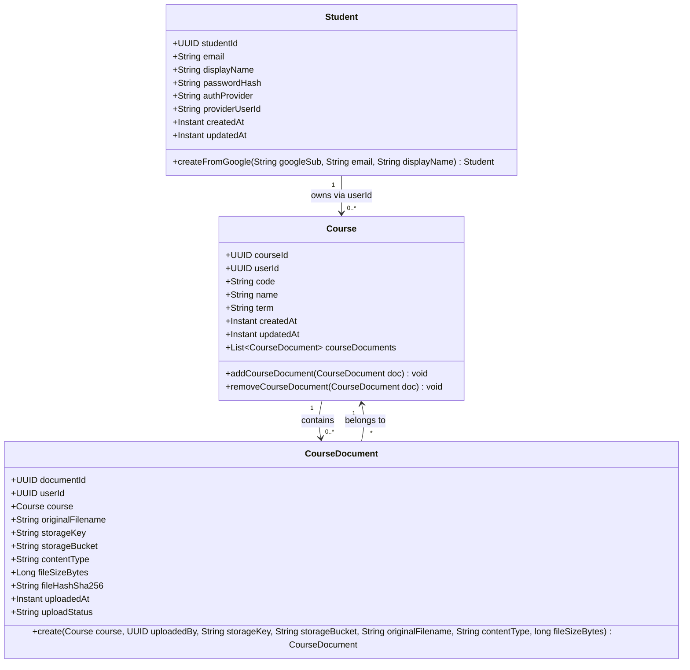

# Class Diagram - Domain Model

```mermaid
classDiagram
    class Student {
      +UUID studentId
      +String email
      +String displayName
      +String passwordHash
      +String authProvider
      +String providerUserId
      +Instant createdAt
      +Instant updatedAt
      +createFromGoogle(String googleSub, String email, String displayName) Student
    }

    class Course {
      +UUID courseId
      +UUID userId
      +String code
      +String name
      +String term
      +Instant createdAt
      +Instant updatedAt
      +List~CourseDocument~ courseDocuments
      +addCourseDocument(CourseDocument doc) void
      +removeCourseDocument(CourseDocument doc) void
    }

    class CourseDocument {
      +UUID documentId
      +UUID userId
      +Course course
      +String originalFilename
      +String storageKey
      +String storageBucket
      +String contentType
      +Long fileSizeBytes
      +String fileHashSha256
      +Instant uploadedAt
      +String uploadStatus
      +create(Course course, UUID uploadedBy, String storageKey, String storageBucket, String originalFilename, String contentType, long fileSizeBytes) CourseDocument
    }

    Student "1" --> "0..*" Course : owns via userId
    Course "1" --> "0..*" CourseDocument : contains
    CourseDocument "*" --> "1" Course : belongs to
```

## Notes
- Ownership is represented through `userId` fields.
- `Course` and `CourseDocument` are aggregate-linked via JPA relationship.
