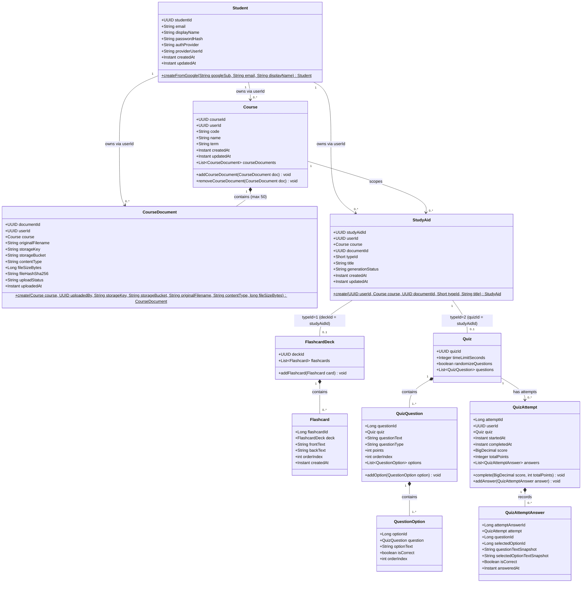

# Class Diagram - Domain Model

## Aggregate Boundaries

| Aggregate Root | Owned Entities |
|---|---|
| `Course` | `CourseDocument` (max 50) |
| `StudyAid` | `FlashcardDeck` → `Flashcard[]` (typeId=1), or `Quiz` → `QuizQuestion[]` → `QuestionOption[]` (typeId=2) |
| `QuizAttempt` | `QuizAttemptAnswer[]` |

## Key Design Notes

- `FlashcardDeck.deckId` and `Quiz.quizId` are **foreign keys** to `StudyAid.studyAidId` (shared-PK inheritance pattern).
- `QuizAttemptAnswer` stores text **snapshots** at submission time so grading history is immutable even if quiz content changes.
- Ownership is tracked via `userId` on `Course`, `CourseDocument`, and `StudyAid` rather than a direct FK to `Student`, allowing lightweight identity checks without cross-aggregate joins.
- `Course.addCourseDocument()` enforces the 50-document business rule at the domain level.
