# Class Diagram - Repositories and Storage Implementations

```mermaid
classDiagram
    class StudentRepository {
      <<interface>>
      +findByProviderUserIdAndAuthProvider(String providerUserId, String authProvider) Optional~Student~
      +findByProviderUserId(String providerUserId) Optional~Student~
      +existsByEmail(String email) boolean
    }

    class JPACourseRepository {
      <<interface>>
      +findByUserId(UUID userId) List~Course~
      +countByUserId(UUID userId) long
      +existsByCourseIdAndUserId(UUID courseId, UUID userId) boolean
      +findByCourseIdAndUserId(UUID courseId, UUID userId) Optional~Course~
    }

    class JPACourseDocumentRepository {
      <<interface>>
      +countByUserId(UUID userId) long
      +findByUserIdOrderByUploadedAtDesc(UUID userId, Pageable pageable) List~CourseDocument~
      +findByCourse_CourseIdOrderByUploadedAtDesc(UUID courseId, Pageable pageable) List~CourseDocument~
      +countByCourse_CourseId(UUID courseId) long
      +findByCourse_CourseId(UUID courseId) List~CourseDocument~
    }

    class CourseRepository {
      <<interface>>
      +findAll() List~CourseDocument~
      +findById(UUID id) Course
      +save(Course course) Course
      +update(UUID id, Course course) void
      +deleteById(UUID id) void
    }

    class CourseDocumentRepository {
      <<interface>>
      +findById(UUID id) CourseDocument
      +save(CourseDocument doc) CourseDocument
      +update(UUID id, CourseDocument doc) CourseDocument
      +deleteById(UUID id) void
    }

    class StorageService {
      <<interface>>
      +upload(InputStream contentStream, String fileName, String contentType) String
      +getPresignedUrl(String storageKey, Duration expiration) String
      +delete(String storageKey) void
      +exists(String storageKey) boolean
    }

    class GCSStorageService {
      -Storage googleStorage
      -String bucketName
      +upload(InputStream contentStream, String fileName, String contentType) String
      +getPresignedUrl(String storageKey, Duration expiration) String
      +delete(String storageKey) void
      +exists(String storageKey) boolean
    }

    class NoopStorageService {
      +upload(InputStream contentStream, String fileName, String contentType) String
      +getPresignedUrl(String storageKey, Duration expiration) String
      +delete(String storageKey) void
      +exists(String storageKey) boolean
    }

    GCSStorageService ..|> StorageService
    NoopStorageService ..|> StorageService
```

## Notes
- JPA repositories are concrete Spring Data entry points used by current use cases.
- Domain repository interfaces exist but are only partially integrated in current implementation.
- Storage provider is selected by property (`gcs` vs `noop`).
