# Class Diagram - Repositories and Storage

```mermaid
classDiagram
    %% ── Domain-layer repository ports ───────────────────────
    class StudentRepository {
      <<interface>>
      +findByProviderUserIdAndAuthProvider(String providerUserId, String authProvider) Optional~Student~
      +findByProviderUserId(String providerUserId) Optional~Student~
      +existsByEmail(String email) boolean
    }

    class CourseRepository {
      <<interface>>
      +findAll() List~Course~
      +findById(UUID id) Course
      +save(Course course) Course
      +update(UUID courseId, Course updatedCourse) void
      +deleteById(UUID id) void
    }

    class CourseDocumentRepository {
      <<interface>>
      +findById(UUID id) CourseDocument
      +save(CourseDocument doc) CourseDocument
      +update(UUID id, CourseDocument doc) CourseDocument
      +deleteById(UUID id) void
    }

    %% ── JPA adapters ─────────────────────────────────────────
    class JPACourseRepository {
      <<interface, JpaRepository>>
      +findByUserId(UUID userId) List~Course~
      +countByUserId(UUID userId) long
      +existsByCourseIdAndUserId(UUID courseId, UUID userId) boolean
      +findByCourseIdAndUserId(UUID courseId, UUID userId) Optional~Course~
    }

    class JPACourseDocumentRepository {
      <<interface, JpaRepository>>
      +countByUserId(UUID userId) long
      +findByUserIdOrderByUploadedAtDesc(UUID userId, Pageable pageable) List~CourseDocument~
      +findByCourse_CourseIdOrderByUploadedAtDesc(UUID courseId, Pageable pageable) List~CourseDocument~
      +countByCourse_CourseId(UUID courseId) long
      +findByCourse_CourseId(UUID courseId) List~CourseDocument~
      +findByUserIdOrderByUploadedAtDesc(UUID userId) List~CourseDocument~
      +findByUserIdAndOriginalFilenameContainingIgnoreCaseOrderByUploadedAtDesc(UUID userId, String filename) List~CourseDocument~
      +findByUserIdAndCourse_CourseIdOrderByUploadedAtDesc(UUID userId, UUID courseId) List~CourseDocument~
    }

    class JPAStudyAidRepository {
      <<interface, JpaRepository>>
      +countByUserId(UUID userId) long
      +findByIdWithCourse(UUID id) Optional~StudyAid~
      +findByCourseIdAndTypeIdWithCourse(UUID courseId, Short typeId) List~StudyAid~
      +findByUserIdOrderByUpdatedAtDesc(UUID userId, Pageable pageable) List~StudyAid~
      +findByCourse_CourseIdOrderByUpdatedAtDesc(UUID courseId, Pageable pageable) List~StudyAid~
      +countByCourse_CourseId(UUID courseId) long
      +findByCourse_CourseIdAndTypeId(UUID courseId, Short typeId) List~StudyAid~
    }

    class JPAFlashcardRepository {
      <<interface, JpaRepository>>
    }

    class JPAFlashcardDeckRepository {
      <<interface, JpaRepository>>
      +findByIdWithFlashcards(UUID deckId) Optional~FlashcardDeck~
    }

    class JPAQuizRepository {
      <<interface, JpaRepository>>
      +findByIdWithQuestionsAndOptions(UUID quizId) Optional~Quiz~
    }

    class JPAQuizAttemptRepository {
      <<interface, JpaRepository>>
      +findByQuiz_QuizIdAndUserIdOrderByStartedAtDesc(UUID quizId, UUID userId) List~QuizAttempt~
      +findByIdWithAnswers(Long attemptId) Optional~QuizAttempt~
    }

    %% ── Storage port and adapters ────────────────────────────
    class StorageService {
      <<interface>>
      +upload(InputStream stream, String fileName, String contentType) String
      +getPresignedUrl(String storageKey, Duration expiration) String
      +download(String storageKey) byte[]
      +delete(String storageKey) void
      +exists(String storageKey) boolean
    }

    class GCSStorageService {
      -Storage googleStorage
      -String bucketName
      +upload(InputStream stream, String fileName, String contentType) String
      +getPresignedUrl(String storageKey, Duration expiration) String
      +download(String storageKey) byte[]
      +delete(String storageKey) void
      +exists(String storageKey) boolean
    }

    class NoopStorageService {
      +upload(InputStream stream, String fileName, String contentType) String
      +getPresignedUrl(String storageKey, Duration expiration) String
      +download(String storageKey) byte[]
      +delete(String storageKey) void
      +exists(String storageKey) boolean
    }

    %% ── Relationships ────────────────────────────────────────
    GCSStorageService ..|> StorageService
    NoopStorageService ..|> StorageService

    JPACourseRepository ..|> CourseRepository
    JPACourseDocumentRepository ..|> CourseDocumentRepository
```

## Notes

- `StudentRepository` extends Spring Data `JpaRepository<Student, UUID>` directly; it is both the domain port and the JPA adapter.
- `CourseRepository` and `CourseDocumentRepository` are custom domain-layer interfaces; `JPACourseRepository` and `JPACourseDocumentRepository` are their JPA adapter implementations.
- `JPAStudyAidRepository`, `JPAFlashcardDeckRepository`, `JPAQuizRepository`, and `JPAQuizAttemptRepository` have no matching domain-layer port — they are used directly by use cases. This is a pragmatic DDD shortcut appropriate for a single-team service.
- `GCSStorageService` is activated by Spring profile property `storage.provider=gcs`; `NoopStorageService` by `storage.provider=noop`.
- `GCSStorageService` generates V4 signed GET URLs; keys use the pattern `documents/{timestamp}_{uuid}_{filename}`.
- `NoopStorageService` throws `UnsupportedOperationException` on all non-delete operations — suitable only for test environments where storage calls are mocked.
