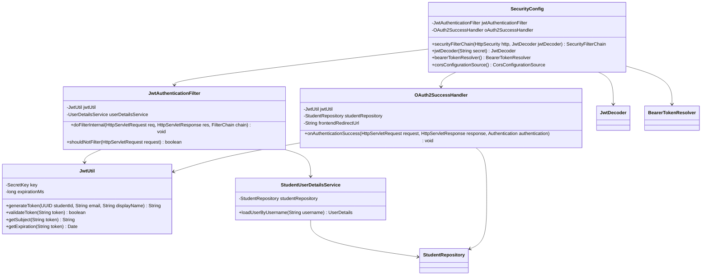

# Class Diagram - Security and Authentication

## Notes
- `SecurityConfig` combines OAuth2 login and resource-server JWT verification.
- `OAuth2SuccessHandler` issues JWT after Google login and redirects frontend.
- `JwtAuthenticationFilter` provides compatibility authentication from bearer token.
