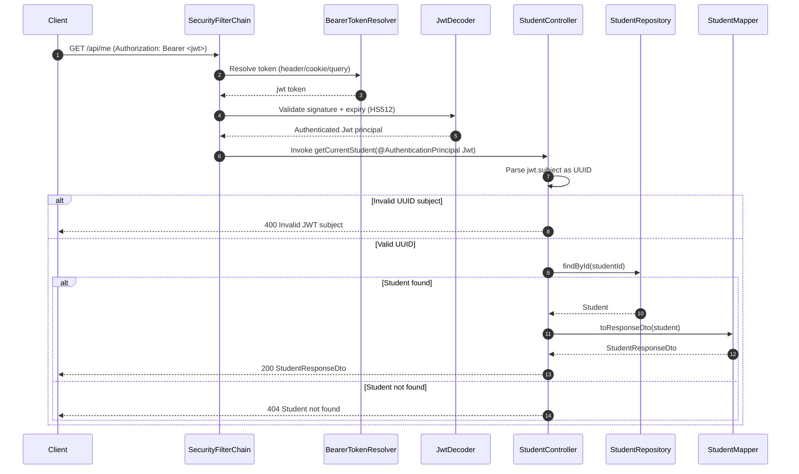

# Sequence Diagram - `GET /api/me`

```mermaid
sequenceDiagram
    autonumber
    participant Client
    participant Security as SecurityFilterChain
    participant Resolver as BearerTokenResolver
    participant JwtDecoder
    participant Controller as StudentController
    participant StudentRepo as StudentRepository
    participant Mapper as StudentMapper

    Client->>Security: GET /api/me (Authorization: Bearer <jwt>)
    Security->>Resolver: Resolve token (header/cookie/query)
    Resolver-->>Security: jwt token
    Security->>JwtDecoder: Validate signature + expiry (HS512)
    JwtDecoder-->>Security: Authenticated Jwt principal

    Security->>Controller: Invoke getCurrentStudent(@AuthenticationPrincipal Jwt)
    Controller->>Controller: Parse jwt.subject as UUID
    alt Invalid UUID subject
        Controller-->>Client: 400 Invalid JWT subject
    else Valid UUID
        Controller->>StudentRepo: findById(studentId)
        alt Student found
            StudentRepo-->>Controller: Student
            Controller->>Mapper: toResponseDto(student)
            Mapper-->>Controller: StudentResponseDto
            Controller-->>Client: 200 StudentResponseDto
        else Student not found
            Controller-->>Client: 404 Student not found
        end
    end
```

## Result
- Valid authenticated user receives profile payload.
- Invalid subject or missing student yields controlled client errors.
