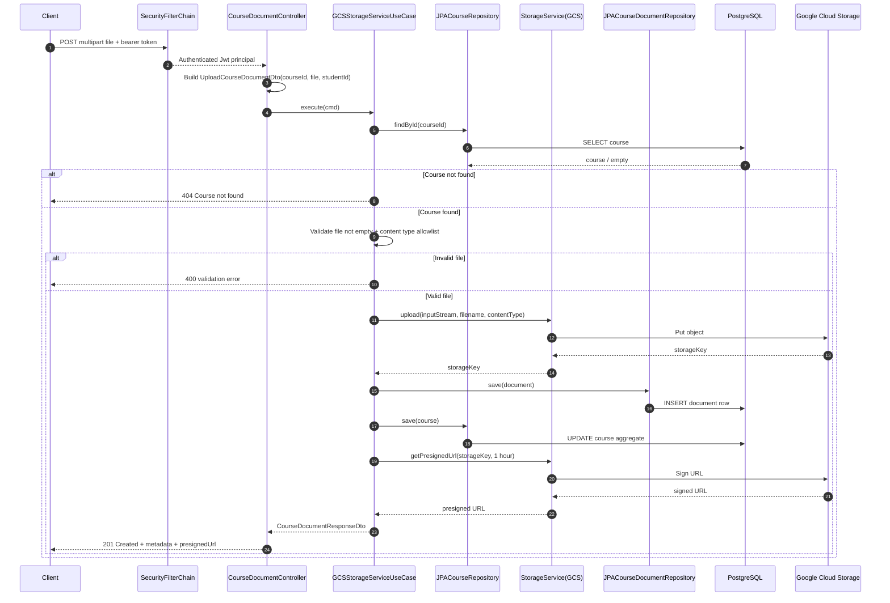

# Sequence Diagram - `POST /api/courses/{courseId}/documents`

```mermaid
sequenceDiagram
    autonumber
    participant Client
    participant Security as SecurityFilterChain
    participant Controller as CourseDocumentController
    participant UploadUC as GCSStorageServiceUseCase
    participant CourseRepo as JPACourseRepository
    participant Storage as StorageService(GCS)
    participant DocRepo as JPACourseDocumentRepository
    participant DB as PostgreSQL
    participant GCS as Google Cloud Storage

    Client->>Security: POST multipart file + bearer token
    Security-->>Controller: Authenticated Jwt principal
    Controller->>Controller: Build UploadCourseDocumentDto(courseId, file, studentId)
    Controller->>UploadUC: execute(cmd)

    UploadUC->>CourseRepo: findById(courseId)
    CourseRepo->>DB: SELECT course
    DB-->>CourseRepo: course / empty
    alt Course not found
        UploadUC-->>Client: 404 Course not found
    else Course found
        UploadUC->>UploadUC: Validate file not empty + content type allowlist
        alt Invalid file
            UploadUC-->>Client: 400 validation error
        else Valid file
            UploadUC->>Storage: upload(inputStream, filename, contentType)
            Storage->>GCS: Put object
            GCS-->>Storage: storageKey
            Storage-->>UploadUC: storageKey

            UploadUC->>DocRepo: save(document)
            DocRepo->>DB: INSERT document row
            UploadUC->>CourseRepo: save(course)
            CourseRepo->>DB: UPDATE course aggregate

            UploadUC->>Storage: getPresignedUrl(storageKey, 1 hour)
            Storage->>GCS: Sign URL
            GCS-->>Storage: signed URL
            Storage-->>UploadUC: presigned URL

            UploadUC-->>Controller: CourseDocumentResponseDto
            Controller-->>Client: 201 Created + metadata + presignedUrl
        end
    end
```

## Result
- Upload persists metadata in DB and stores file in GCS.
- Response includes presigned URL for immediate access.
