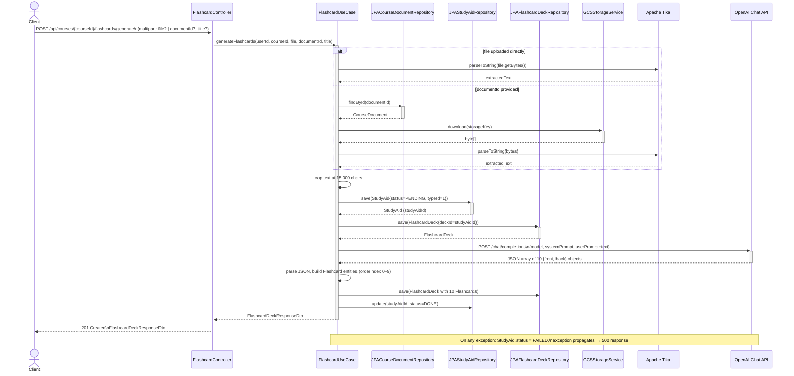

# Sequence Diagram - Flashcard Deck Generation

## Notes

- Text is extracted via Apache Tika regardless of whether a file is uploaded directly or retrieved from GCS via `documentId`.
- The 15,000-character cap prevents token limit errors on OpenAI's side.
- `StudyAid` and `FlashcardDeck` are created **before** the OpenAI call so that a FAILED status can be persisted if generation errors.
- The entire operation is `@Transactional` — if saving flashcards fails after OpenAI returns, the StudyAid record is rolled back.
- There is no retry or background queue; the caller blocks until generation completes or fails.
