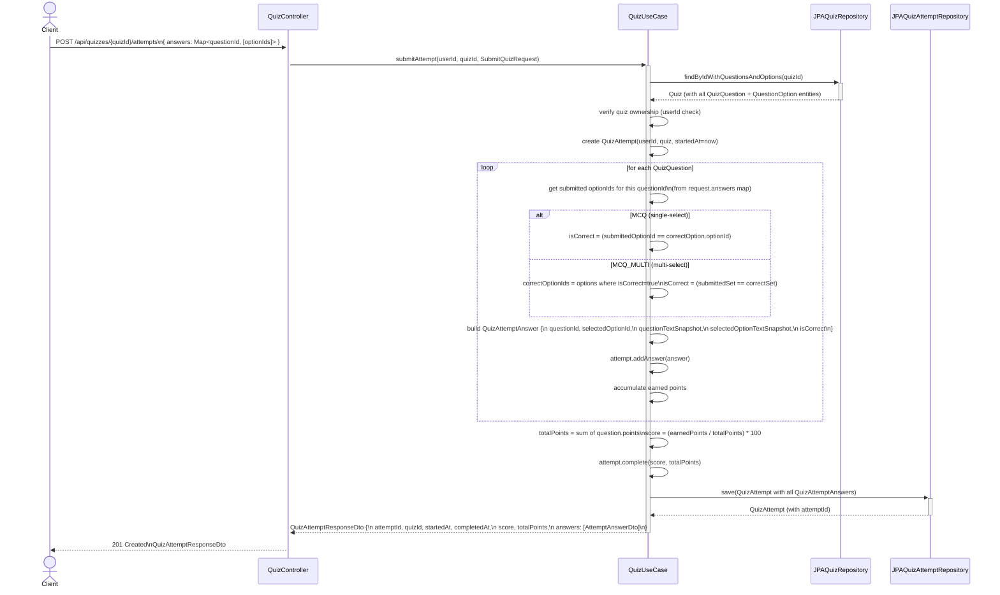

# Sequence Diagram - Quiz Attempt Submission & Grading

## Notes

- The quiz is fetched with a single JOIN query (`findByIdWithQuestionsAndOptions`) to avoid N+1 problems.
- Grading logic is pure Java inside `QuizUseCase` — no external service call.
- MCQ grading: the single submitted option must match the one correct option.
- MCQ_MULTI grading: the set of submitted option IDs must exactly equal the set of all correct option IDs (no partial credit).
- `questionTextSnapshot` and `selectedOptionTextSnapshot` are copied from the live entities at submission time, making the attempt record immutable even if the quiz is later deleted or modified.
- `score` is stored as `BigDecimal` (percentage, 2 decimal places). A perfect score = `100.00`.
- `completedAt` is set inside `attempt.complete()` which also records `totalPoints`.
