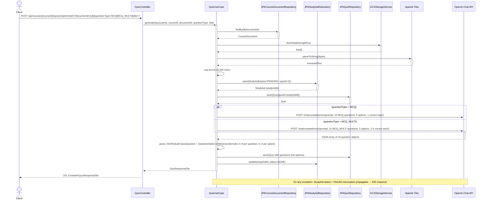

# Sequence Diagram - Quiz Generation

## Notes

- Unlike flashcard generation, quiz generation **always** requires an existing `documentId` — direct file upload is not supported on the quiz endpoint.
- The `questionType` parameter controls the system prompt sent to OpenAI: MCQ enforces exactly 1 correct option; MCQ_MULTI enforces 2–5 correct options per question.
- `StudyAid` and `Quiz` records are created before the OpenAI call so failure state can be persisted.
- Questions and options are saved with `orderIndex` fields to guarantee deterministic retrieval order.
- The whole method is `@Transactional`; a failed save after a successful OpenAI call results in a full rollback.
